# Task 2: Kubernetes

## Exercise Goals

* Install minikube;
* Create namespace;
* Create deployment;
  * Use the golang webserver image you built in the previous step;
  * Add `readiness/liveness` probe;
  * Add `prestophook`;
  * add init container that sleep for 30 seconds;
* Create service to expose your pod;

## Expected Output

Please, provide us with a file named `namespace.yaml` you are going to create. Your `namespace.yaml` is supposed to:

* Contain the following Kubernetes Resources you are going to create in your `minikube` cluster:
  * Namespace specification;

Please, provide us with a file named `app.yaml` you are going to create. Your `app.yaml` is supposed to:

* Contain the following Kubernetes Resources you are going to create in your `minikube` cluster:
  * Deployment specification;
    * Use your new image created on the [Task 1](../dockerize) in your deployment;
  * Service specification;

[Optional] You can also share screenshots of your progress.

[namespace.yaml](./namespace.yaml)

```yaml
apiVersion: v1
kind: Namespace
metadata:
  name: webserver-assessment
spec: {}
```

[app.yaml](./app.yaml)
```yaml
apiVersion: v1
kind: ConfigMap
metadata:
  name: dockerize-scripts
  namespace: webserver-assessment
  labels:
    app: dockerize
data:
  init.sh: |-
    #!/bin/sh

    # Init Container Script
    date -u '+%Y-%m-%d_%H:%M:%S'

    cat /app/server.config
    cat /app/init.sql
    cat /app/init.sh

    secs=30;
    while [ $secs -gt 0 ]; do
      echo -ne "Waiting for $secs\033[0K\r"
      sleep 1
      : $((secs--))
    done

  prestop.sh: |-
    #!/bin/sh

    # PreStop Script for Graceful Shooting Down
    echo "Stopping container now..." && kill -n SIGINT 1 > /proc/1/fd/1
---
apiVersion: v1
kind: ConfigMap
metadata:
  name: dockerize-sql
  namespace: webserver-assessment
  labels:
    app: dockerize
data:
  init.sql: |-
    CREATE DATABASE IF NOT EXISTS {{MYSQL_DATABASE}};
    CREATE USER IF NOT EXISTS {{MYSQL_USER}} IDENTIFIED BY '{{MYSQL_PASSWORD}}';
    GRANT ALL PRIVILEGES ON {{MYSQL_DATABASE}}.* TO {{MYSQL_PASSWORD}} WITH GRANT OPTION;
    GRANT SELECT, INSERT, UPDATE, DELETE, CREATE, DROP, INDEX, ALTER, CREATE TEMPORARY TABLES ON {{MYSQL_DATABASE}}.* TO {{MYSQL_USER}} WITH GRANT OPTION;
    FLUSH PRIVILEGES;
    USE {{MYSQL_DATABASE}};

    SHOW GRANTS FOR {{MYSQL_USER}};

    CREATE TABLE IF NOT EXISTS articles
    (
      id         int unsigned auto_increment primary key,
      title      longtext    not null,
      post_text  longtext    not null,
      date       datetime(3) not null,
      image_url  longtext    not null
      );

    CREATE TABLE IF NOT EXISTS tags
    (
      id  int unsigned auto_increment primary key,
      tag varchar(500)  not null
      );

    CREATE TABLE IF NOT EXISTS articles_tags (
                                               id          INT unsigned AUTO_INCREMENT,
                                               pf_articles INT unsigned NOT NULL,
                                               pf_tags     INT unsigned NOT NULL,
                                               PRIMARY     KEY (id),
      FOREIGN     KEY (pf_articles) REFERENCES articles (id),
      FOREIGN     KEY (pf_tags) REFERENCES tags (id)
      );

    DROP VIEW IF EXISTS blog_posts;
    CREATE VIEW blog_posts AS
    SELECT
      articles.id AS idblog_posts,
      articles.title,
      articles.post_text,
      articles.date,
      articles.image_url,
      cast(concat('[', group_concat(json_quote(tags.tag) ORDER BY tags.tag SEPARATOR ','), ']') as json) AS tags
    FROM
      articles
        INNER JOIN articles_tags
                   ON articles.id = articles_tags.pf_articles
        INNER JOIN tags
                   ON articles_tags.pf_tags = tags.id
    GROUP BY articles.id;

    # Data
    INSERT INTO tags (tag) VALUES ('Automation');
    INSERT INTO tags (tag) VALUES ('DevOps');
    INSERT INTO tags (tag) VALUES ('DevSecOps');

    INSERT INTO articles (title, post_text, date, image_url)
    VALUES ('DevSecOps Assessment1', 'This is a Blog Test1', '2022-09-11 16:35:21.000', '../Images/DevSecOps.png');

    INSERT INTO articles (title, post_text, date, image_url)
    VALUES ('DevSecOps Assessment2', 'This is a Blog Test2', '2022-09-11 16:35:21.000', '../Images/Accelera-DevSecOps-Security-Controls-Infographic_v1.0_2020_feature.jpg');

    INSERT INTO articles (title, post_text, date, image_url)
    VALUES ('DevSecOps Assessment3', 'This is a Blog Test3', '2022-09-11 16:35:21.000', '../Images/devops-simbolo-01.png');

    INSERT INTO articles (title, post_text, date, image_url)
    VALUES ('Automation Assessment1', 'This is a Blog Automation Test1', '2022-09-11 16:35:21.000', '../Images/devops-tools.png');

    INSERT INTO articles (title, post_text, date, image_url)
    VALUES ('Automation Assessment2', 'This is a Blog Automation Test2', '2022-09-11 16:35:21.000', '../Images/devsecops-diagram.png');

    INSERT INTO articles (title, post_text, date, image_url)
    VALUES ('DevSecOps Automation Assessment1', 'This is a Blog Automation Test1', '2022-09-11 16:35:21.000', '../Images/finops.png');

    INSERT INTO articles_tags (pf_articles, pf_tags) VALUES (1, 2);
    INSERT INTO articles_tags (pf_articles, pf_tags) VALUES (1, 3);
    INSERT INTO articles_tags (pf_articles, pf_tags) VALUES (2, 2);
    INSERT INTO articles_tags (pf_articles, pf_tags) VALUES (2, 3);
    INSERT INTO articles_tags (pf_articles, pf_tags) VALUES (3, 2);
    INSERT INTO articles_tags (pf_articles, pf_tags) VALUES (3, 3);
    INSERT INTO articles_tags (pf_articles, pf_tags) VALUES (4, 1);
    INSERT INTO articles_tags (pf_articles, pf_tags) VALUES (5, 1);
    INSERT INTO articles_tags (pf_articles, pf_tags) VALUES (6, 1);
    INSERT INTO articles_tags (pf_articles, pf_tags) VALUES (6, 2);
---
apiVersion: apps/v1
kind: Deployment
metadata:
  name: dockerize
  namespace: webserver-assessment
  labels:
    app: dockerize
spec:
  progressDeadlineSeconds: 300
  strategy:
    type: RollingUpdate
    rollingUpdate:
      maxSurge: 1
      maxUnavailable: 0
  selector:
    matchLabels:
      app: dockerize
  revisionHistoryLimit: 10
  replicas: 2
  template:
    metadata:
      labels:
        app: dockerize
    spec:
      terminationGracePeriodSeconds: 60
      initContainers:
        - name: init
          image: busybox
          command: ['/bin/sh', '-c', '/app/init.sh']
          envFrom:
            - secretRef:
                name: mysql-secrets
          volumeMounts:
            - name: mysql-secrets
              mountPath: /app/server.config
              subPath: server.config
              readOnly: true
            - name: dockerize-scripts
              mountPath: /app/init.sh
              subPath: init.sh
              readOnly: true
            - name: dockerize-sql
              mountPath: /app/init.sql
              subPath: init.sql
              readOnly: true
      containers:
        - name: dockerize
          image: elioseverojunior/dockerize:latest
          envFrom:
            - secretRef:
                name: mysql-secrets
          ports:
            - containerPort: 8080
          lifecycle:
            preStop:
              exec:
                command: ["sh", "-c", "/app/scripts/prestop.sh"]
          livenessProbe:
            httpGet:
              path: /
              port: 8080
            initialDelaySeconds: 10
            periodSeconds: 5
            timeoutSeconds: 2
            successThreshold: 1
            failureThreshold: 3
          readinessProbe:
            httpGet:
              path: /
              port: 8080
            initialDelaySeconds: 10
            periodSeconds: 10
            timeoutSeconds: 2
            successThreshold: 1
            failureThreshold: 3
          resources:
            limits:
              cpu: 100m
              memory: 128Mi
            requests:
              cpu: 100m
              memory: 128Mi
          volumeMounts:
            - name: mysql-secrets
              mountPath: /app/server.config
              subPath: server.config
              readOnly: true
            - name: dockerize-scripts
              mountPath: /app/scripts/prestop.sh
              subPath: prestop.sh
              readOnly: true
      volumes:
        - name: mysql-secrets
          secret:
            secretName: mysql-secrets
            items:
              - key: server.config
                path: server.config
        - name: dockerize-scripts
          configMap:
            name: dockerize-scripts
            items:
              - key: init.sh
                path: init.sh
              - key: prestop.sh
                path: prestop.sh
            defaultMode: 0755
        - name: dockerize-sql
          configMap:
            name: dockerize-sql
            items:
              - key: init.sql
                path: init.sql
            defaultMode: 0644
      dnsPolicy: ClusterFirst
---
apiVersion: v1
kind: Service
metadata:
  name: dockerize
  namespace: webserver-assessment
  labels:
    app: dockerize
spec:
  type: LoadBalancer
  ports:
    - port: 80
      targetPort: 8080
      protocol: TCP
      name: http
  selector:
    app: dockerize
---
apiVersion: autoscaling/v2
kind: HorizontalPodAutoscaler
metadata:
  name: dockerize
  namespace: webserver-assessment
spec:
  scaleTargetRef:
    apiVersion: apps/v1
    kind: Deployment
    name: dockerize
  minReplicas: 2
  maxReplicas: 10
  metrics:
    - type: Resource
      resource:
        name: cpu
        target:
          type: Utilization
          averageUtilization: 50
    - type: Resource
      resource:
        name: memory
        target:
          type: Utilization
          averageUtilization: 50
```

### Share Screenshots

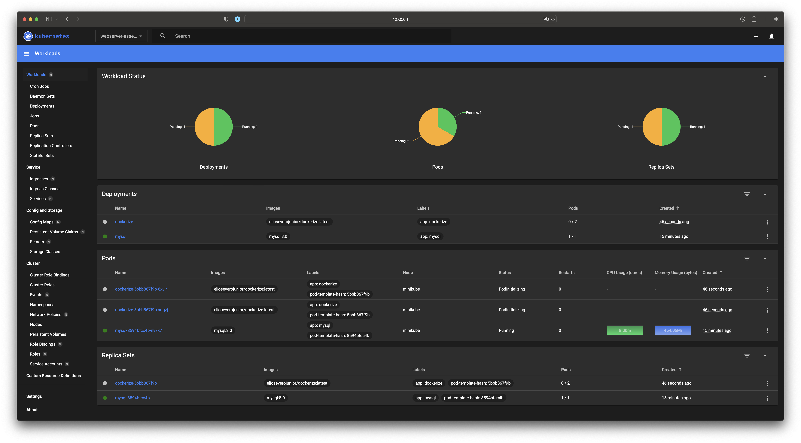

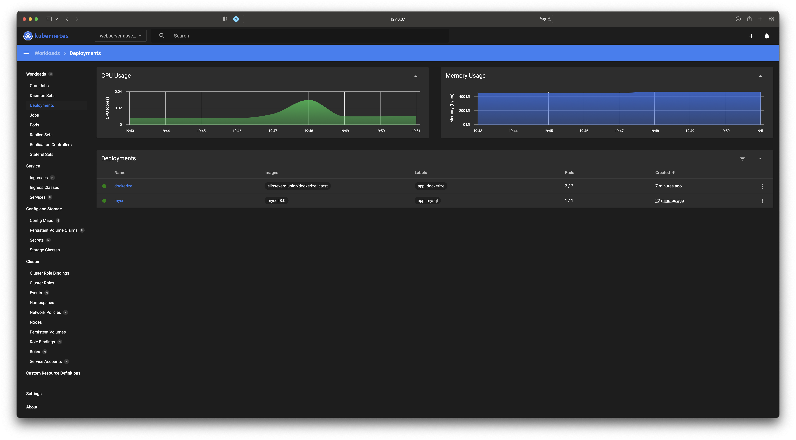

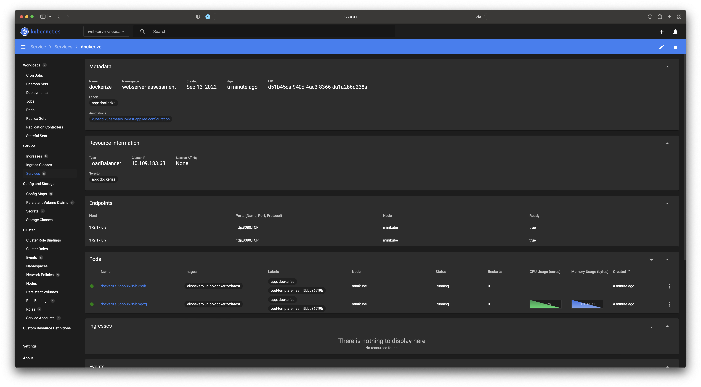

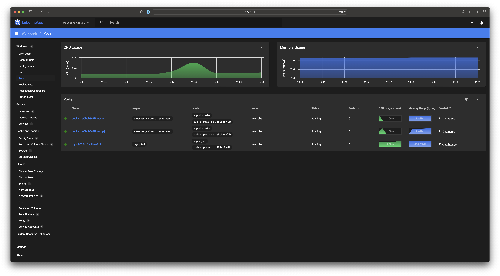

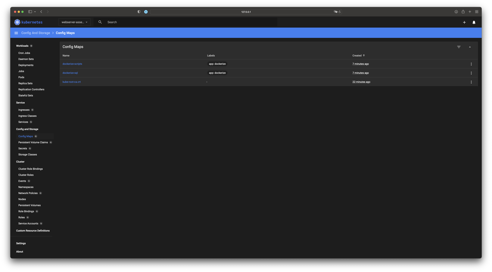

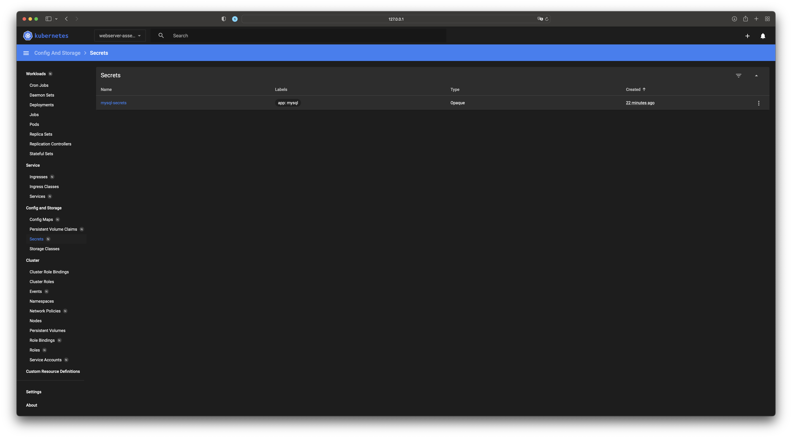

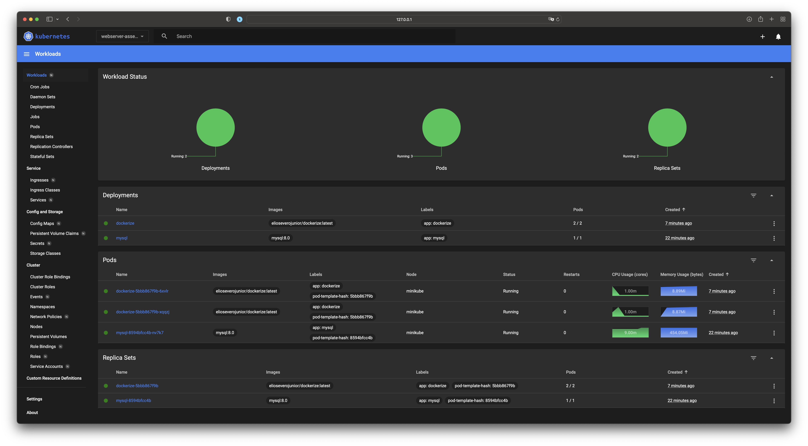

### Commands

```bash
minikube start --driver=hyperkit --addons=helm-tiller --addons=metrics-server --addons=metallb --addons=dashboard
minikube service dockerize -n webserver-assessment
```

### Getting Events
```bash
kubectl get events --sort-by='.metadata.creationTimestamp' --namespace webserver-assessment
```

### Load Generator
```bash
kubectl run -i --tty -n webserver-assessment load-generator --rm --image=busybox:1.28 --restart=Never -- /bin/sh -c "while sleep 0.01; do wget -q -O- http://dockerize/api/articles; done"
```

### Application Running

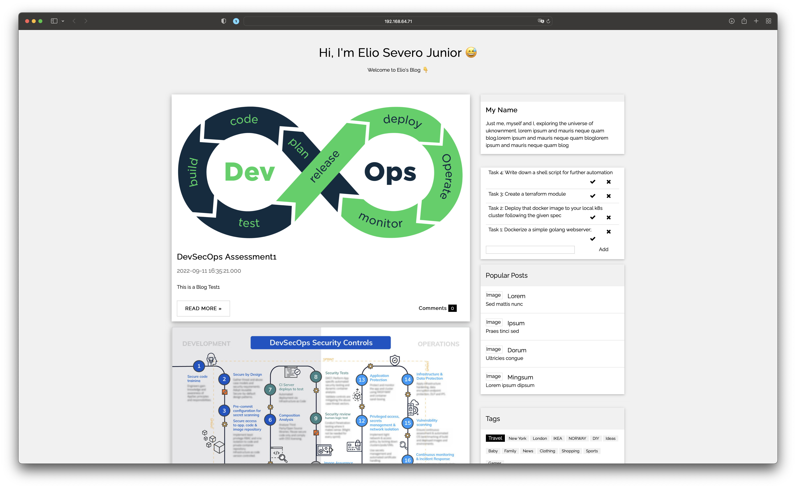

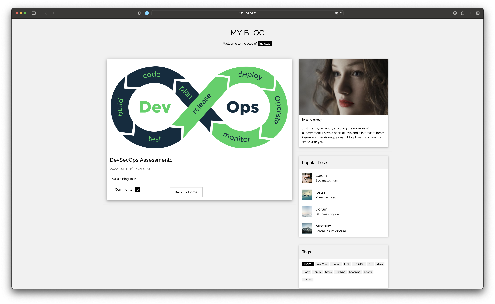

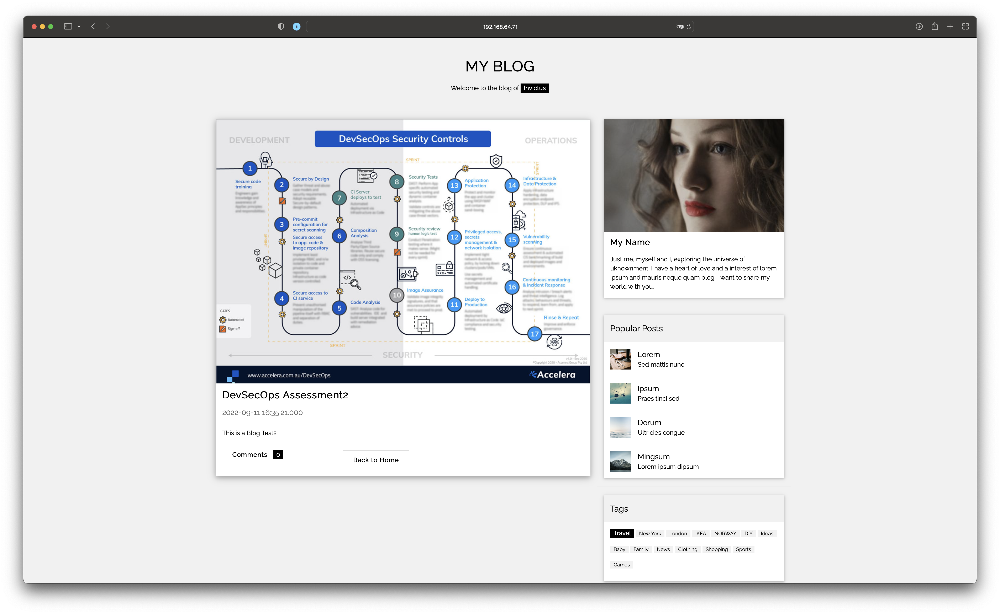

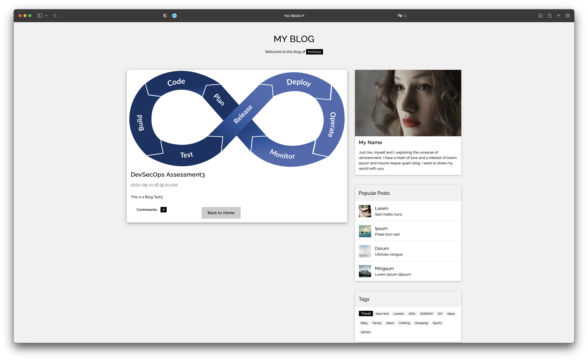

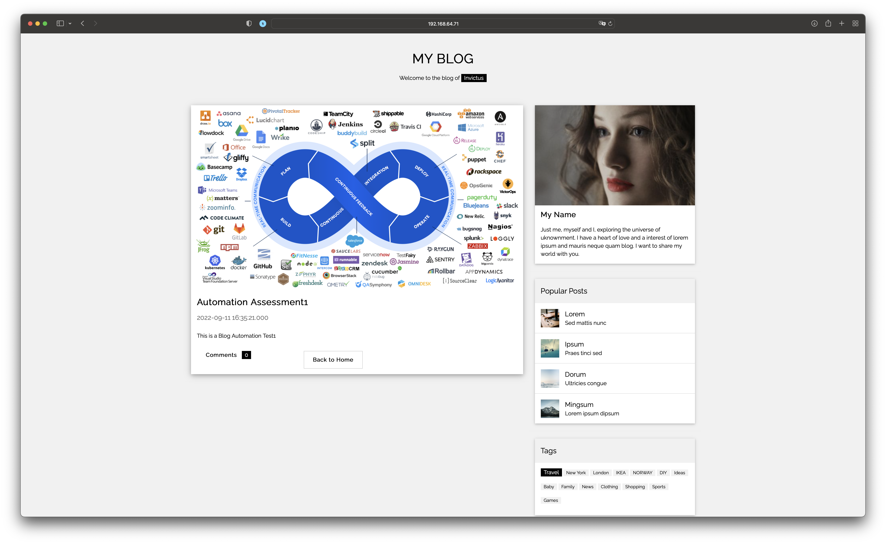

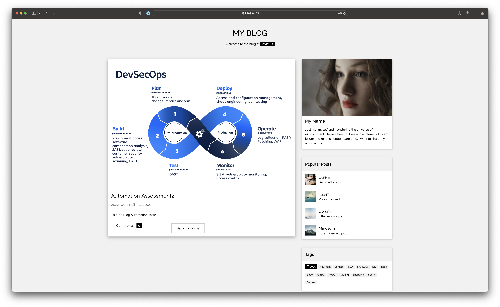

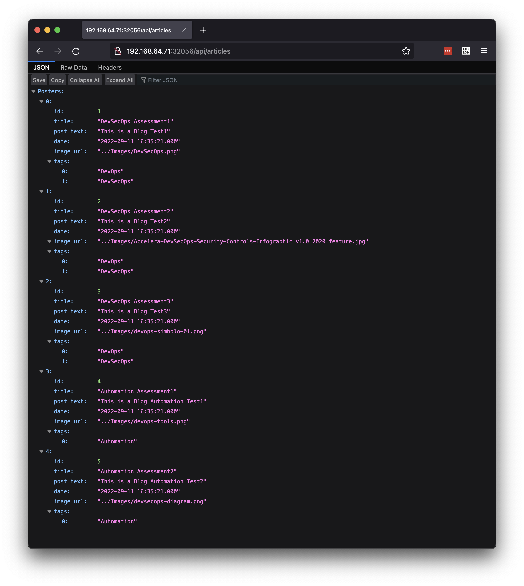

## Next steps?

Once you complete this task, you can proceed to the [Terraform](../terraform) task;
