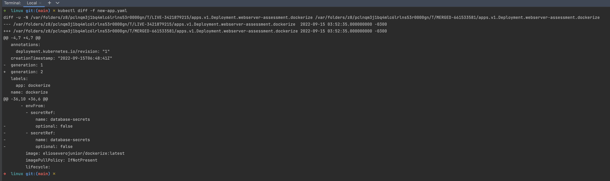

# Task 4: Linux

## Exercise Goals

* Copy your `app.yaml` from your second task to this folder with the name `script.yaml`:
  * Replace the `image` value in your deployment by: `MY_NEW_IMAGE`
* Create a Bash Script named `automation.sh` to:
  * Build the `Dockerfile` you created on the first task;
  * After building your `Dockerfile`, your `Bash Script` is supposed to tag your image dynamically;
    * You can use hash, date, sequential or any tagging approach you think it is good here;
  * Use your `script.yaml` as a template file to:
    * Create a new file called `new-app.yaml` replacing the `MY_NEW_IMAGE` by your new image tag/name;
  * Use `kubectl` to show the difference between the current state in your `minikube` and your newly created `new-app.yaml`;

## Expected Output

Please, provide us with a file named `automation.sh` you created. Your `automation.sh` is supposed to:

* Build your `Dockerfile`;
* Tag your image dynamically;
* Create a new `new-app.yaml` file;
* Compare the `new-app.yaml` with your current state in your `minikube`;

Please, provide us with your `script.yml` and `new-app.yaml` files;

[Optional] You can also share screenshots of your progress.

### Requirements

* jq
* kubectl
* minikube
* terraform

### Automation BashScript

#### Usage
```text
USAGE:
  automation.sh
    -i|--image                  <docker image>                Default is elioseverojunior/dockerize:latest
    --no-build-docker-images    <no build docker new image>   Default is true
    --no-push-docker-images     <no push docker new image>    Default is true
    --no-run-minikube           <no run minikube deployment>  Default is true
    --no-run-terraform          <deploy with terraform>       Default is true
    --start-minikube-dashboard  <start minikube dashboard>    Default is false
    -h|--help                   <display this help>
```

### Running `automation.sh`

```bash
cd linux
bash automation.sh
```

```bash
cd linux
bash automation.sh -i elioseverojunior/test:latest
```


```bash
cd linux
bash automation.sh -i elioseverojunior/dockerize:latest --no-push-docker-images --no-build-docker-images --no-run-terraform --start-minikube-dashboard
```

### Kubectl Diff Command
```bash
kubectl diff -f new-app.yaml
```



### Next steps?

Once you complete this task, send us your assignment, so we can evaluate it;
